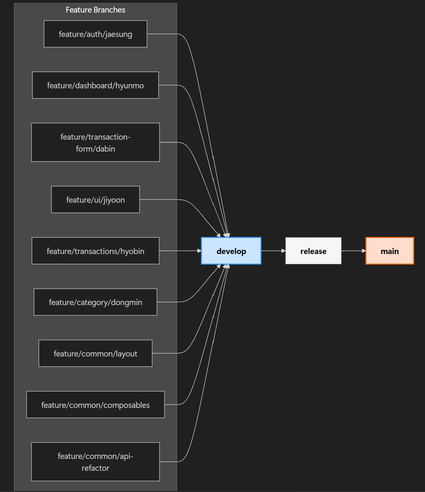

# 💰 Vue3 온라인 가계부 프로젝트

Vue 3 + Composition API + Pinia 기반의 온라인 가계부 프로젝트입니다.\
수입/지출 기록, 거래 내역 조회, 월별 요약 통계를 제공합니다.

---

## 📆 설치 및 시작

```bash
npm install
npm run dev
```

> 주: `db.json` 바탕의 json-server는 검색/거래 전역을 방지

---

## 📁 디렉토리 구조 (Domain-based)

```
src
├── assets
├── components                  # 재사용 가능한 UI 컨테이너
│   ├── base                    # 공통 UI 요소
│   ├── TransactionItem.vue
│   ├── ChartSummary.vue
│   └── SelectCategory.vue
├── views                       # 페이지 단위 컴포넌트(라우터연결)
├── layouts                     # 레이아웃 (Header/Footer)
├── composables                 # Composition API 기반 재사용 가능 로직
├── stores                      # Pinia 상태 관리
├── services                    # API 통신 로직
├── router
├── App.vue
└── main.js
```

---

## 🧐 상태 관리 (Pinia modules)

| Store                 | 역할                       |
| --------------------- | -------------------------- |
| `authStore.js`        | 사용자 로그인/정보         |
| `transactionStore.js` | 거래 내역 관리, 필터, 삭제 |
| `categoryStore.js`    | 카테고리 목록/선택 상태    |
| `dashboardStore.js`   | 월별 통계, 체크 데이터     |
| `uiStore.js`          | 모달, 로딩 등 UI상태       |

---

## 👥 팀원별 컴포넌트 담당 현황

| 이름   | 기능 영역          | 담당 컴포넌트 / Store                                                                                    | 비고                                                   |
| ------ | ------------------ | -------------------------------------------------------------------------------------------------------- | ------------------------------------------------------ |
| 이재성 | 로그인 / 설정      | `LoginView.vue`, `SettingsView.vue` / `authStore.js`                                                     | 사용자 인증 및 프로필 설정                             |
| 박다빈 | 거래 등록          | `TransactionForm.vue`, `SelectCategory.vue` / `transactionStore.js`, `categoryStore.js`                  | 거래 등록 및 카테고리 선택                             |
| 전효빈 | 거래 리스트 / 삭제 | `TransactionView.vue`, `TransactionList.vue`, `TransactionItem.vue` / `transactionStore.js`              | 거래 내역 조회 및 삭제 처리                            |
| 양현모 | 데시보드 / 체티    | `DashboardView.vue`, `ChartSummary.vue` / `dashboardStore.js`                                            | 월별 요약 통계 및 시각화                               |
| 황동민 | 카테고리 관리      | `SelectCategory2.vue` / `categoryStore.js`                                                               | 카테고리 관리 담당 (병합 전 SelectCategory.vue와 분기) |
| 양지윤 | 공통 UI / 모달     | `BaseModal.vue`, `DefaultLayout.vue`, `AuthLayout.vue`, `BaseButton.vue`, `BaseInput.vue` / `uiStore.js` | 공통 UI 컴포넌트 및 레이아웃 담당                      |

---

## 🌿 기본 브랜치 전략

### ✅ 팀원별 브랜치 전략 및 담당 기능

| 담당자 | 브랜치 이름                      | 기능 영역            | 주요 파일 / 설명                                                    |
| ------ | -------------------------------- | -------------------- | ------------------------------------------------------------------- |
| 이재성 | `feature/auth/jaesung`           | 로그인 / 설정        | `LoginView.vue`, `SettingsView.vue`, `authStore.js`                 |
| 박다빈 | `feature/transaction-form/dabin` | 거래 등록            | `TransactionForm.vue`, `SelectCategory.vue`, `categoryStore.js`     |
| 전효빈 | `feature/transactions/hyobin`    | 거래 내역 / 삭제     | `TransactionView.vue`, `TransactionList.vue`, `TransactionItem.vue` |
| 양현모 | `feature/dashboard/hyunmo`       | 대시보드 / 차트      | `DashboardView.vue`, `ChartSummary.vue`, `dashboardStore.js`        |
| 황동민 | `feature/category/dongmin`       | 카테고리 관리        | `SelectCategory2.vue`, `categoryStore.js`                           |
| 황동민 | `feature/common/api-refactor`    | 공통 API 리팩토링    | `api.js`, `authService.js`, `transactionService.js` 등              |
| 양지윤 | `feature/ui/jiyoon`              | 공통 UI / 모달       | `BaseModal.vue`, `BaseButton.vue`, `BaseInput.vue`, `uiStore.js`    |
| 양지윤 | `feature/common/layout`          | 공통 레이아웃        | `DefaultLayout.vue`, `AuthLayout.vue`                               |
| 양지윤 | `feature/common/composables`     | 공통 Composable 로직 | `useAuth.js`, `useTransaction.js`, `useAccount.js`                  |



---

## 📂 커밋 규칙

### 📌 커밋 메시지 규칙 (Conventional Commit)

- `feat`: 새로운 기능 추가
- `fix`: 버그 수정
- `docs`: 문서 수정 (예: README, 주석 등)
- `style`: 코드 스타일 변경 (세미콜론, 들여쓰기 등)
- `refactor`: 리팩토링 (기능 변화 없이 구조 개선)
- `test`: 테스트 코드 추가 및 수정
- `chore`: 기타 설정, 빌드 등 변경 사항

**예시 커밋 메시지**

- `feat: 거래 내역 페이지 필터 기능 추가`
- `fix: 모달 닫기 버튼이 작동하지 않던 이슈 수정`
- `docs: README에 브랜치 전략 추가`

---

## 📜 이슈 템플릿 가이드

### 📝 GitHub 이슈 작성 양식

**[제목]**

- [기능/버그/리팩토링] 간단한 요약

**[설명]**

- 어떤 작업인지, 이유는 무엇인지 명확히 작성

**[할 일 체크리스트]**

- [ ] 작업 목표 1
- [ ] 작업 목표 2
- [ ] 리뷰 및 병합 요청

**[관련 브랜치]**

- 예: `feature/transaction-list/hyobin`

**[관련 커밋 또는 PR]**

- 링크 또는 SHA
